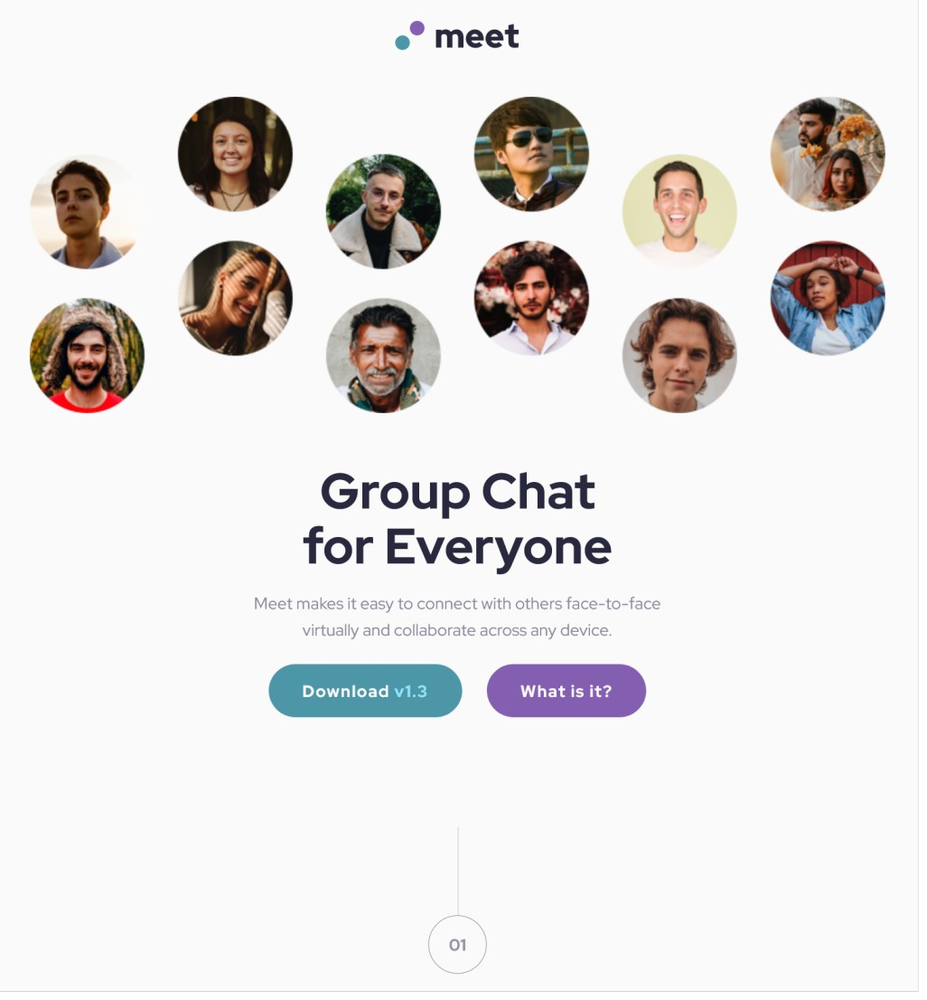
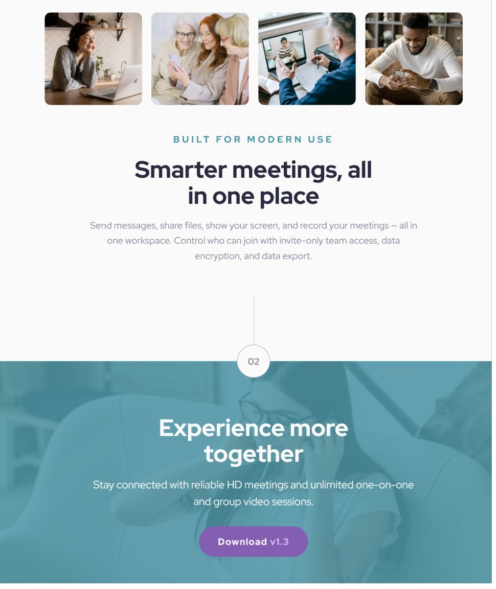

# Meet Landing Page

This is a solution to the [Meet landing page challenge on Frontend Mentor](https://www.frontendmentor.io/challenges/meet-landing-page-rbTDS6OUR). Frontend Mentor challenges help you improve your coding skills by building realistic projects. 

## Table of contents

- [Overview](#overview)
  - [The challenge](#the-challenge)
  - [Screenshot](#screenshot)
  - [Links](#links)
- [My Process](#my-process)
  - [Built with](#built-with)
  - [What I learned](#what-i-learned)
- [Author](#author)

## Overview

### The challenge

Users should be able to:

- View the optimal layout depending on their device's screen size
- See hover states for interactive elements

### Screenshots

### Links

- [solution URL](https://www.frontendmentor.io/solutions/responsive-landing-page-using-flexbox-and-css-grid-sdErLR-L6)
- [live site URL](https://mattpahuta.github.io/meet-landing-page/)

## My process

### Built with

- Semantic HTML5 markup
- CSS custom properties
- Flexbox
- CSS Grid
- Mobile-first workflow

### What I learned

- A simple wireframe of the site, showing grids and breakpoints, is worth developing before you start the markup and base styles.
- Keep it simple where you can. Start getting the layout looking right using the most straightforward methods available, then mix in complexity when needed.

## Author

- Frontend Mentor - [@MattPahuta](https://www.frontendmentor.io/profile/MattPahuta)
- Twitter - [@MattPahuta](https://twitter.com/MattPahuta)